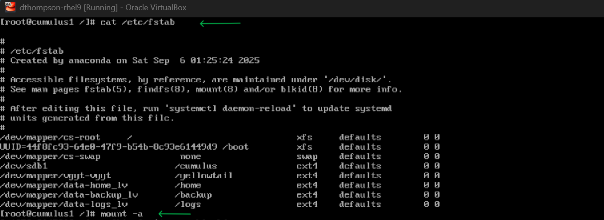

# My LVM Project
Project: Secure Disk Partitioning with LVM on CentOS for Enterprise Server. Real-world scenario: Configured CentOS VM as a multi-user file server for a small business – partitioned disks for OS, user data (/home), logs (/logs), and backups (/backup) using LVM for flexibility and easy expansion. Prevents full-disk issues and enhances data isolation.

  
Create a virtual machine using VirtualBox, and apply your configurations

  
Enter VM Settings → Storage → Controller: SATA → select hard disk icon

  
Hard Disk selector, click the Create New icon

  
Name file, set size (20GB), choose format

  
Verify hard disk created → ready to launch VM

Boot VM & log in 
-Run lsblk > list disks, LVM, swap devices
  
Lsblk shows size, mount point, and type
(Note: A disk can only provision 4 partitions. To circumvent this limitation, LVM allows you to create, edit, and manage partitions more easily)
fdisk /dev/sdc open device partition table 
 
A list of prompts will follow to input the desired parameters for your new logical partition. 

Prompt........ Select: P (primary) or E (extended) determines the type of partition you are to create.   Here we are using P (primary)

Partition number: identifies which partition of a disk you are creating  (1 -4) or (E -extended) 

-First sector: first 516 bytes of the LVM

-Last sector: size of the LVM determined by available space

-Partition table prompt command: T > to change the ID type of LVM 

-Selected partition: identify specific partition 
 
8e -LVM partition type
w to save and exit

pvcreate /dev/sdc1 creates a physical volume 

vgcreate data /dev/sdc1 = creates physical volumes, (data) provision a name for the volume group
 Note: Several logical volumes can be created under one volume group (VG)
 

Lvcreate -L 5m -n home_lv data =  creates LV, (-L) determines sizes of LV,  (-n) names the LV, (data) identifies VG
*Repeat Lvcreate for each division ( /home, /logs, & /backup ) to create flexibility, security, and expansion, allowing for data isolation and preventing disk issues

 
Make a filesystem using (MKFS) with .ext4 
mkfs.ext4 /dev/mapper/data-home_lv 
repeat step for each division ( /home, /logs , /backup) 
-Create a mount point for each division: mkdir (/home, /logs, /backup)

  
mount /dev/mapper/data-home_lv /data = mount FS to logical volume

lsblk / df -hT
Verify the mount using

 
vi /etc/fstab sets permanent mount points for partitions & initiates auto mount in boot

 
Vi /etc/fstab / mount -a 
Set permanent mount points

Insert entry into fstab  /dev/mapper/data-home_lv  /home  ext4 defaults 0 0 
Note: repeat for each division (/home, /logs, /backup)

 
Run the command (mount -a), then reboot VM  
Verify LV is persistent (lsblk, df -ht)

 
review /etc/ftsab, verify persistence lsblk / df -hT

 
df -hT to view filesystems

 
Let's extend our filesystems, lvextend to increase size of each filesystem

 
Lvdisplay to show the table of logical volumes

 
Lvdisplay shows updated LV info

  
Verify extension

 
df -hT verify 

Success!!!! 

